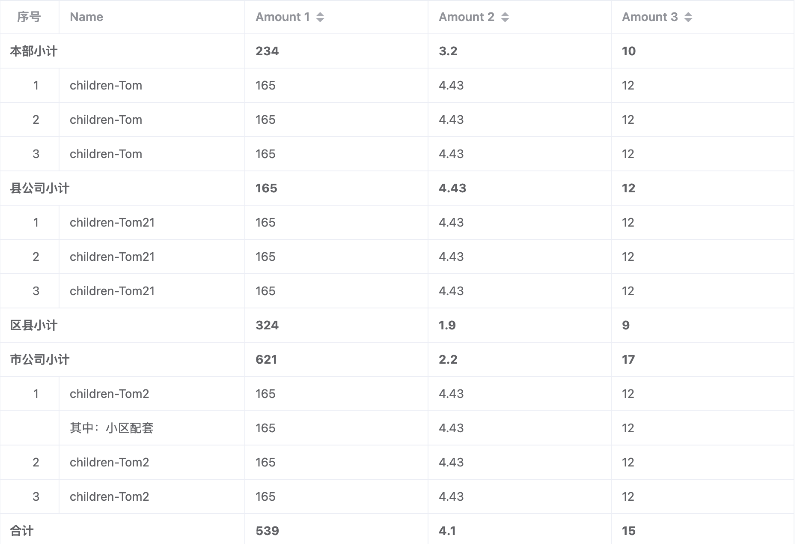

# Element-plus的el-table组件实现分组表格

### 效果图



---

### 实现思路

1. 接口树形数据；

2. 树形第一级第一级合并单元格；

3. 自定义序号，实现分组内序号；

#### 实现代码

```vue
<template>
  <div>
    <el-table
      :data="tableData"
      :span-method="arraySpanMethod"
      border
      row-key="id"
      style="width: 100%"
      default-expand-all
    >
      <el-table-column label="序号" prop="index" align="center" width="70" :index2="indexMethod"  />
      <el-table-column prop="name" label="Name" />
      <el-table-column prop="amount1" sortable label="Amount 1" />
      <el-table-column prop="amount2" sortable label="Amount 2" />
      <el-table-column prop="amount3" sortable label="Amount 3" />
    </el-table>
  </div>
</template>

<script lang="ts" setup>
import { onMounted } from 'vue';
import type { TableColumnCtx } from 'element-plus'

interface User {
  id: string
  name: string
  amount1: string
  amount2: string
  amount3: number
  index: number
  level: number
  children?: Array<User>
}

interface SpanMethodProps {
  row: User
  column: TableColumnCtx<User>
  rowIndex: number
  columnIndex: number
}

const indexMethod =()=>{
  return 0;
}

const arraySpanMethod = ({
  row,
  column,
  rowIndex,
  columnIndex,
}: SpanMethodProps) => {
  if(row.level == 0 && row.children){
    if(columnIndex == 0){
      return [0, 0]
    }else if(columnIndex == 1){
      return [1,2]
    }
  }

}

const deep=(list, level = 0)=>{
    return list.map((item, index)=>{
      item.level = level;
      if(level<2){
        item.index = index + 1;
      }
      if(item.children){
        item.children = deep(item.children, level+1);
      }
      return item;
    })
}


onMounted(()=>{
   deep(tableData)
   console.log('tableData', tableData, deep(tableData))
})


const tableData: User[] = [
  {
    id: '12987122',
    name: '本部小计',
    amount1: '234',
    amount2: '3.2',
    amount3: 10,
    children: [
      {
        id: '12987123',
        name: 'children-Tom',
        amount1: '165',
        amount2: '4.43',
        amount3: 12,
      },
      {
        id: '12987123',
        name: 'children-Tom',
        amount1: '165',
        amount2: '4.43',
        amount3: 12,
      },
      {
        id: '12987123',
        name: 'children-Tom',
        amount1: '165',
        amount2: '4.43',
        amount3: 12,
      },
    ]
  },
  {
    id: '12987123',
    name: '县公司小计',
    amount1: '165',
    amount2: '4.43',
    amount3: 12,
    children: [
      {
        id: '1298712321',
        name: 'children-Tom21',
        amount1: '165',
        amount2: '4.43',
        amount3: 12,
      },
      {
        id: '1298712321',
        name: 'children-Tom21',
        amount1: '165',
        amount2: '4.43',
        amount3: 12,
      },
      {
        id: '1298712321',
        name: 'children-Tom21',
        amount1: '165',
        amount2: '4.43',
        amount3: 12,
      },
    ]
  },
  {
    id: '12987124',
    name: '区县小计',
    amount1: '324',
    amount2: '1.9',
    amount3: 9,
    children: []
  },
  {
    id: '12987125',
    name: '市公司小计',
    amount1: '621',
    amount2: '2.2',
    amount3: 17,
    children: [
      {
        id: '129871232',
        name: 'children-Tom2',
        amount1: '165',
        amount2: '4.43',
        amount3: 12,
        children: [
            {
              id: '1298712323',
              name: '其中：小区配套',
              amount1: '165',
              amount2: '4.43',
              amount3: 12,
            }
        ]
      },
      {
        id: '129871232',
        name: 'children-Tom2',
        amount1: '165',
        amount2: '4.43',
        amount3: 12,
      },
      {
        id: '129871232',
        name: 'children-Tom2',
        amount1: '165',
        amount2: '4.43',
        amount3: 12,
      },
    ]
  },
  {
    id: '12987126',
    name: '合计',
    amount1: '539',
    amount2: '4.1',
    amount3: 15,
    children: []
  },
]
</script>
<style>
.el-table__expand-icon .el-icon {
  display: none;
}
.el-table__placeholder,
.el-table__expand-icon--expanded {
  display: none !important;
}
.el-table__row--level-0{
  font-weight: bold;
}
.el-table__row:not([class*="--level-"]){
  font-weight: bold;
}
</style>
```
