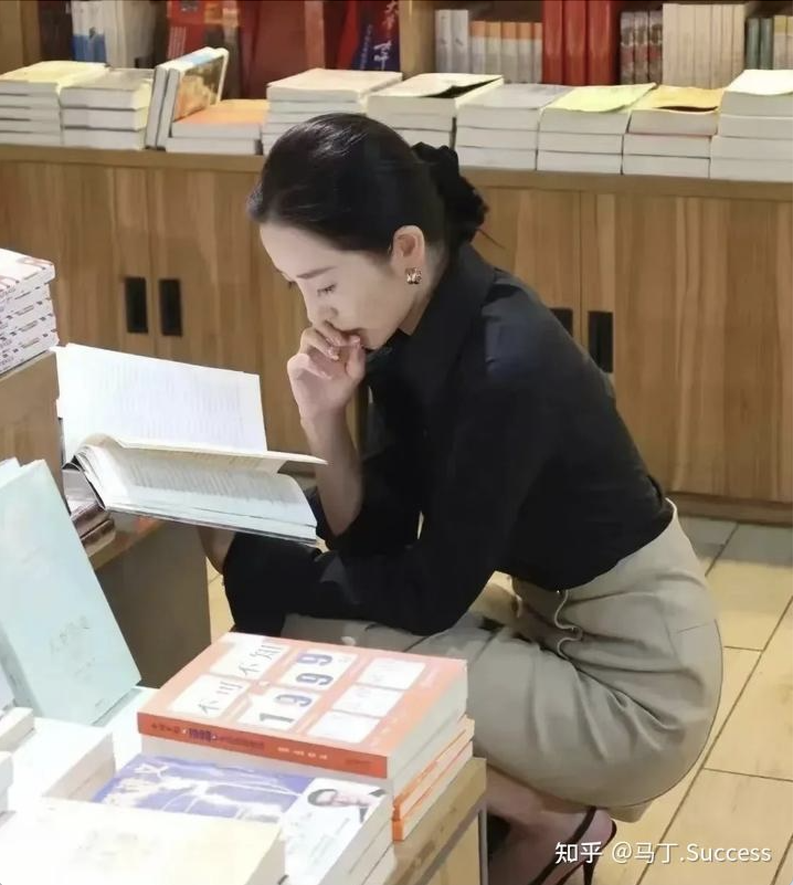

# 知乎文摘

人生有很多课题，
不同阶段要修不同的专业课，
尽管能力水平有高低，
却是不能不修的。

这些专业课大概是这样的：

1. 在学生阶段就是基础人际和基础知识，学习能力和学历证书；

2. 刚出社会阶段就是社会人际和两性关系，做事能力和赚钱能力；

3. 为人父母阶段就是家庭家族关系和子女教育，人情世故经历练和求真悟道寻规律；

4. 退休阶段大概就是厚德载物积信望，云淡风轻自逍遥。

 这就是老祖宗说的人要守本分吧

- 人情世故经历练, 求真悟道寻规律;
- 厚德载物积信望，云淡风轻自逍遥。
